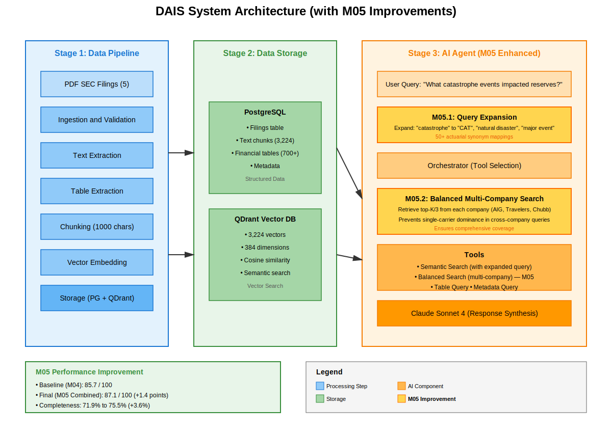
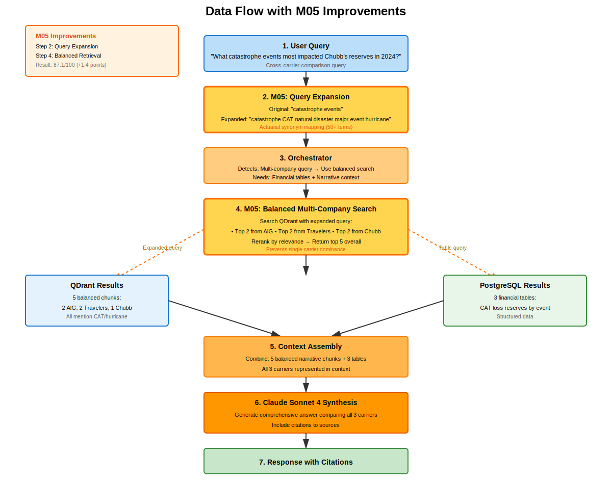
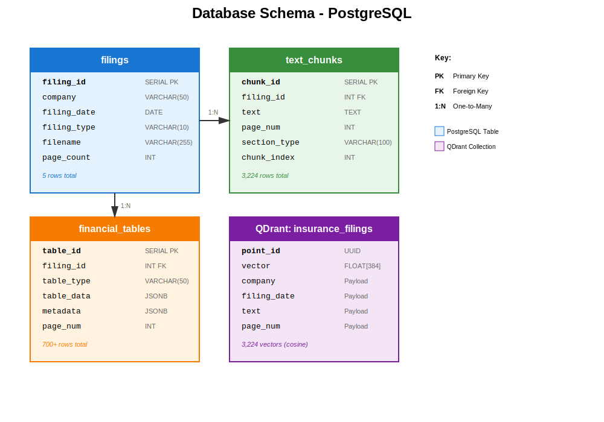

# P&C Insurance Reserving Intelligence System

Automated agentic AI system for analyzing P&C insurance 10-K/10-Q filings from AIG, Travelers, and Chubb.

## System Overview

**M02 - Data Pipeline:** Ingests SEC filings, extracts text/tables, generates embeddings, stores in vector database  
**M03 - AI Agent:** Interactive chat interface and batch query system for actuarial Q&A

## Features

### Data Pipeline (M02)
- ✅ PDF ingestion and validation
- ✅ Metadata extraction (company, filing date, type)
- ✅ Text extraction with section detection
- ✅ Financial table extraction
- ✅ Semantic chunking with overlap
- ✅ Vector embeddings (sentence-transformers)
- ✅ Multi-database storage (PostgreSQL + QDrant)

### AI Agent (M03)
- ✅ Semantic search across filings
- ✅ Natural language Q&A interface
- ✅ Company-specific filtering
- ✅ Source attribution and citations
- ✅ Batch query evaluation system

## Quick Start

### Prerequisites
- Docker & Docker Compose
- (Optional) Anthropic API key for chat interface

### 1. Setup Input Data

Place PDF files in the following structure:
```
data/raw/
├── AIG/
│   └── 2024/
│       └── aig_10q_2024q3.pdf
├── Travelers/
│   └── 2024/
│       └── travelers_10k_2024.pdf
└── Chubb/
    └── 2024/
        └── chubb_10q_2024q2.pdf
```

### 2. Start Data Pipeline (M02)
```bash
# Start all services
docker-compose up -d

# Monitor processing
docker-compose logs -f pipeline

# Verify data loaded
docker-compose exec postgres psql -U postgres -d insurance_filings -c "SELECT company, COUNT(*) FROM text_chunks GROUP BY company;"
```

**Expected Output:**
- 5 filings processed
- ~3,224 text chunks
- ~700 financial tables

### 3. Run AI Agent (M03)

#### Option A: View Pre-Generated Results (No API Key Required)
```bash
# See batch query results from 8 test questions
cat data/results.json | python3 -m json.tool
```

#### Option B: Interactive Chat Demo (Requires API Key)

**Get Free API Key:**
1. Sign up at https://console.anthropic.com/ (free $5 credit)
2. Create API key
3. Add to `.env` file:
```bash
echo "ANTHROPIC_API_KEY=sk-ant-your-key-here" >> .env
```

**Run Chat Interface:**
```bash
# Install dependencies (local - not in Docker)
python3 -m venv venv
source venv/bin/activate  # On Windows: venv\Scripts\activate
pip install -r requirements.txt

# Start chat interface
streamlit run src/interfaces/streamlit_app.py
```

**Run Batch Queries:**
```bash
# Using Docker (recommended)
docker-compose run --rm pipeline python /app/src/interfaces/batch_query.py --input /data/eval_queries.json --output /data/results.json

# Results saved to data/results.json
```

## Architecture

### System Overview (with M05 Improvements)


The architecture shows three stages:
1. **Data Pipeline (M02):** Processes 5 SEC filings into 3,224 chunks and 700+ tables
2. **Data Storage:** Hybrid PostgreSQL + QDrant architecture
3. **AI Agent (M03, enhanced in M05):** 
   - **M05.1 Query Expansion:** Maps actuarial terms to synonyms (50+ mappings)
   - **M05.2 Balanced Retrieval:** Ensures multi-company representation

### Data Flow


### Database Schema


## Database Access

**PostgreSQL:**
```bash
docker-compose exec postgres psql -U postgres -d insurance_filings

# Example queries
SELECT company, filing_type, page_count FROM filings;
SELECT COUNT(*) FROM text_chunks;
```

**QDrant Dashboard:**
```
http://localhost:6333/dashboard
```

**Neo4j Browser (Optional):**
```
http://localhost:7474
Username: neo4j
Password: password123
```

## Project Structure

```
insurance-filings-pipeline/
├── data/
│   ├── input/              # PDF SEC filings
│   ├── output/             # Processing artifacts
│   ├── processed/          # Processed data
│   └── .gitkeep
├── diagrams/               # Visual architecture diagrams (M02)
│   ├── architecture_diagram_m05.svg
│   ├── database_schema.svg
│   └── dataflow_diagram_m05.svg
├── eval/                   # M04 evaluation + M05 ablation
│   ├── initial/
│   │   ├── eval_queries_test.json
│   │   └── results_test.json
│   ├── eval_test_set.json
│   ├── eval_results_baseline.json      # V1: 85.7
│   ├── results_query_exp_only.json     # V2: 79.6
│   ├── results_balanced_only.json      # V3: 86.1
│   ├── results_combined.json           # V4: 87.1 (WINNER)
│   └── run_evaluation.py
├── notebooks/
│   └── exploratory_analysis.ipynb
├── pipeline/              # M02: Data pipeline
│   ├── __init__.py
│   ├── chunk_text.py
│   ├── embed.py
│   ├── extract_text.py
│   ├── ingest.py
│   ├── run_ingest.py
│   ├── section_filter.py
│   └── table_extractor.py
├── src/
│   ├── agents/            # M03: AI agent + M05 improvements
│   │   ├── iterations/           # M05: Ablation variants
│   │   │   ├── orchestrator_balance_only.py
│   │   │   ├── orchestrator_baseline.py
│   │   │   ├── orchestrator_combined.py
│   │   │   ├── orchestrator_query_exp.py
│   │   │   ├── tools_balance_only.py
│   │   │   ├── tools_baseline.py
│   │   │   ├── tools_combined.py
│   │   │   └── tools_query_exp.py
│   │   ├── __init__.py
│   │   ├── orchestrator.py       # Production (V4 Combined)
│   │   ├── query_expansion.py    # M05: Synonym expansion
│   │   └── tools.py              # Production (V4 Combined)
│   ├── storage/
│   │   ├── __init__.py
│   │   ├── postgres_client.py
│   │   └── qdrant_client.py
│   ├── utils/
│   │   ├── __init__.py
│   │   ├── logger.py
│   │   └── validators.py
│   └── __init__.py
├── tests/
│   ├── __init__.py
│   ├── test_extraction.py
│   ├── test_pipeline.py
│   ├── test_processing.py
│   └── test_storage.py
├── .env
├── .env.example
├── .gitignore
├── backfill_qdrant.py
├── docker-compose.yml
├── Dockerfile
├── eval_queries.json
├── M02_MILESTONE.md
├── M03_MILESTONE.md
├── M04_MILESTONE.md
├── M05_MILESTONE.md
├── Milestone-Evaluation.md
├── project-evaluation-scores.csv
├── README.md
├── requirements.txt
├── resync_qdrant.py
├── resync_qdrant_v2.py
├── results.json
└── test_pymupdf.py
```

## System Statistics

**Data Processed (M02):**
- 5 SEC filings (2 x 10-K, 3 x 10-Q)
- 3,224 text chunks
- ~700 financial tables
- 3,224 vector embeddings

**Agent Capabilities (M03):**
- Semantic search across all filings
- Company-specific filtering (AIG, Travelers, Chubb)
- Natural language understanding
- Multi-source synthesis
- Citation tracking

## Example Queries
```python
# Try these in the chat interface:
"What did AIG say about reserve adequacy in their latest filing?"
"Compare loss development across all carriers"
"What external risks impacted reserves?"
"Show me commercial auto reserve trends"
"How are carriers addressing social inflation?"
```

## Monitoring & Debugging

**Check pipeline progress:**
```bash
docker-compose logs -f pipeline
```

**Database statistics:**
```sql
-- Chunks per company
SELECT f.company, COUNT(c.chunk_id) as chunks
FROM filings f
LEFT JOIN text_chunks c ON f.filing_id = c.filing_id
GROUP BY f.company;

-- QDrant collection info
curl http://localhost:6333/collections/insurance_filings | python3 -m json.tool
```

**Common Issues:**

| Issue | Solution |
|-------|----------|
| PDF extraction fails | Verify PDFs not corrupted: `pdfinfo file.pdf` |
| Out of memory | Reduce batch size in `embedder.py` |
| Database connection errors | Check services: `docker-compose ps` |
| Chat interface slow | First load takes ~30s to load embedding model |
| API authentication error | Verify `.env` has `ANTHROPIC_API_KEY` |

## Performance Notes

**M02 Pipeline:**
- Processing time: ~5-10 minutes for 5 PDFs
- Memory usage: ~2GB peak

**M03 Chat Interface:**
- Initial load: ~30-60 seconds (loading embedding model)
- Query response time: 3-5 seconds average
- API cost: ~$0.01-0.02 per query (with Claude)

## Deliverables

### M02 ✅
- [x] Multi-stage data pipeline
- [x] PDF text extraction (pdfplumber)
- [x] Vector embeddings (sentence-transformers)
- [x] PostgreSQL + QDrant storage
- [x] 3,224 chunks processed

### M03 ✅
- [x] Agent orchestrator with semantic search
- [x] Streamlit chat interface
- [x] Batch query evaluation system
- [x] Pre-generated results (`data/results.json`)

## Tech Stack

**M02 Pipeline:**
- Python 3.9
- pdfplumber (PDF extraction)
- sentence-transformers (embeddings)
- PostgreSQL 15 (structured data)
- QDrant (vector search)

**M03 Agent:**
- Anthropic Claude API (LLM)
- Streamlit (chat UI)
- Custom orchestration (tool calling)

## Configuration

Environment variables (`.env`):
```env
# Database connections (M02)
POSTGRES_HOST=postgres
POSTGRES_PORT=5432
POSTGRES_DB=insurance_filings
POSTGRES_USER=postgres
POSTGRES_PASSWORD=postgres
QDRANT_HOST=qdrant
QDRANT_PORT=6333
INPUT_DIR=/data/raw

# AI Agent (M03)
ANTHROPIC_API_KEY=sk-ant-your-key-here  # Optional - for chat demo
```
